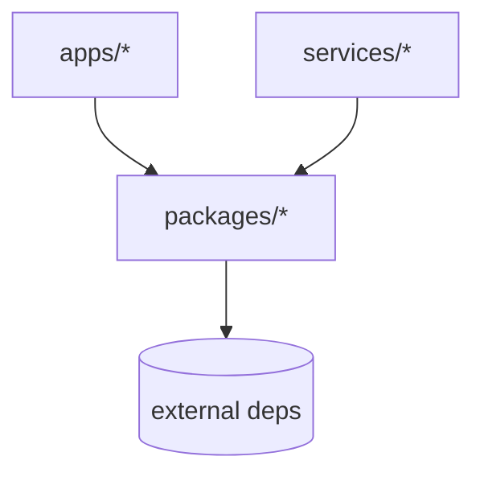
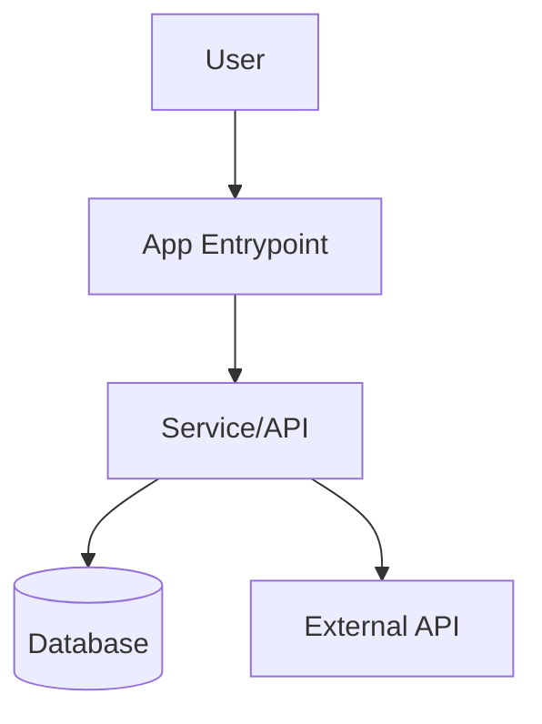
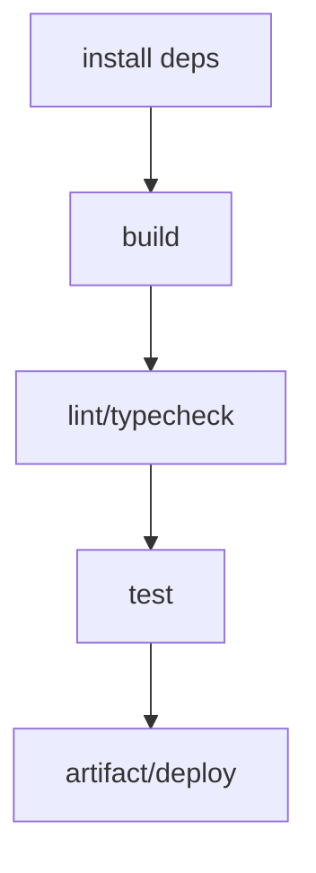

# Repo Wiki Architect (Strict Mode)

Maintain `WIKI.md` as a factual, navigable architecture index.
Primary goal: make onboarding and impact analysis fast, without policy noise.

## Non-Negotiable Rules

1. `WIKI.md` contains repository facts only, never assistant behavior/prompt policy.
2. Never copy policy text from `AGENTS.md`/`CLAUDE.md`; link them for navigation only.
3. Every file/symbol reference must be verified in current repo state.
4. If not verified, exclude it or mark `N/A` (never infer).
5. Use repository-relative Markdown links only.
6. Keep updates incremental: patch affected sections; avoid full rewrites.
7. Keep naming stable across revisions (same module/package IDs).

## Trigger Conditions

Use when user asks for:
- `WIKI.md` creation/update,
- architecture mapping,
- dependency/runtime diagrams,
- monorepo navigation docs,
- wiki refresh after code changes.

## Discovery Order (Strict)

1. Root: `README.md`, workspace manifests, lockfiles, tsconfig/workspace config.
2. Governance/context files: `AGENTS.md`, `CLAUDE.md`, `.cursor/*`, `.pi/*`, etc. (links only).
3. Monorepo topology: `apps/*`, `packages/*`, `services/*`, `libs/*` (whichever exists).
4. Entrypoints + composition roots (CLI, HTTP servers, workers, schedulers).
5. Integration boundaries (DB, queues, external APIs, SDKs).

Collect:
- ownership boundaries,
- import/dependency edges,
- runtime flows,
- critical symbols and responsibilities.

## Monorepo Segmentation Rules

For monorepos, always segment docs by scope:

- **Applications** (`apps/*`): user-facing/runtime entry systems.
- **Services** (`services/*`): long-running backends/workers.
- **Packages/Libraries** (`packages/*`, `libs/*`): reusable modules.
- **Platform/Infra** (`docker/`, `k8s/`, CI files, scripts).

If a scope is missing, keep heading and write `N/A`.

## Required `WIKI.md` Contract

Keep headings exactly. Use `N/A` for non-applicable sections.

````markdown
# Repo Brief

4–8 lines: repo purpose, architecture style, where to start, and current scope note (full/partial mapping).

## Monorepo Topology

- `[apps/](apps/)`: app layer
- `[services/](services/)`: service layer
- `[packages/](packages/)`: shared libraries
- `[AGENTS.md](AGENTS.md)`: agent instructions (navigation only)

## Ownership Matrix

| Scope | Owner Module | Responsibility | Depends On |
|---|---|---|---|
| `apps/web` | `apps/web/src/main.ts` | UI composition root | `packages/ui`, `services/api` |

## Package Map

| Package/Module | Role | Public Entrypoints | Internal Dependencies |
|---|---|---|---|
| `packages/core` | Domain logic | `packages/core/src/index.ts` | `packages/types` |

## Key File References

- `[path/to/file.ts](path/to/file.ts)`: why it exists + boundary

## Key Symbol References

- `SymbolName` in `[path/to/file.ts](path/to/file.ts)`: responsibility + main callers
- `N/A` where symbol extraction is not reliable (with short reason)

## Dependency Rules

- Allowed edges:
  - `apps/* -> packages/*`
  - `services/* -> packages/*`
- Forbidden edges:
  - `packages/* -> apps/*`
- Exceptions:
  - list explicit, verified exceptions only

## Knowledge Graph

### Entity/Relation Table

| From | Relation | To | Why |
|---|---|---|---|
| `apps/web` | imports | `packages/ui` | shared UI primitives |

### Layered Dependency Diagram



### Runtime Flow Diagram



### Build/Test Flow Diagram


````

## Strict Validation Gates

Before finalizing, enforce all gates:

- [ ] No policy/persona/tool-governance text.
- [ ] All links resolve to real repo-relative paths.
- [ ] Symbols are verified or explicitly `N/A`.
- [ ] Dependency rules reflect actual imports.
- [ ] Diagrams are consistent with tables.
- [ ] Monorepo scopes are all represented (or `N/A`).
- [ ] Coverage mode declared in `Repo Brief` (`full` or `partial`).

## Coverage Modes

- **Partial (default for large repos):**
  - prioritize changed paths + composition roots,
  - deep symbol extraction on top 30 impact files.
- **Full (on request):**
  - scan all scopes, all major packages, all boundary diagrams.

Always state chosen mode in `Repo Brief`.

## Maintenance Protocol

On each relevant code change:

1. detect impacted scopes/files/symbols,
2. patch only affected `WIKI.md` sections,
3. re-validate links/symbols/diagrams for touched areas,
4. preserve unchanged sections verbatim.
